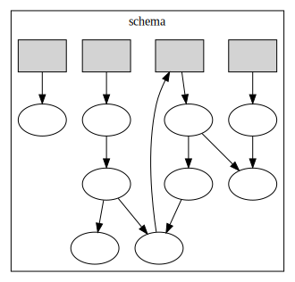

# apg

> TypeScript APG utilities

This is an implementation of an algebraic data model over RDF, generally adapted from [this paper](https://arxiv.org/abs/1909.04881).

Schemas are _self-hosting_, which means that schemas themselves are serialized as RDF datasets and parsed using a [schema schema](schema.schema.json).

The RDF representation is very verbose, even by RDF standards, so we usually use [graphical tools](https://underlay.github.io/playground/schema-editor/index.html) to view, compose, and edit them.

## Table of Contents

- [Overview](#overview)
- [Structures](#structures)
  - [Schemas, labels, and types](#schemas-labels-and-types)
  - [Instances and values](#instances-and-values)
- [API](#api)

## Overview

The birds-eye view is that this library defines a collection of structures that you can use to model, serialize, and parse data - similar to JSON or Protobuf. The reason you'd want to do this is that _this_ data model in particular is a little bit magical: it's unusually good at representing most other data models, and it also gives us a little grammar of schema _mappings_ that we can use transform, migrate, and integrate data more reliably than we could if we were just writing code.

## Structures

There are three basic kinds of structures defined in [src/apg.ts](src/apg.ts): _labels_, which are terms in a grammar of _types_, _schemas_, which are collections of _labels_; _instances_, which are collections of _values_.

### Schemas, labels, and types

A schema is a set of _labels_, each of which has an associated _type_:



Here, the grey rectangles are labels, and the white ellipses are types. The broad intuition is that types can be these complex things composed of other types, and that labels are like "handles" or variables that some of those types are assigned to.

There are a few different kinds of types. Primitive (or "scalar") types are are types like "number" or "string". Then there are two kinds of _composite_ types, which are made up of other types. And lastly there are _reference_ types that point back up to one of the labels.

| Type      |   Kind    |                       Interpretation |
| --------- | :-------: | -----------------------------------: |
| reference | reference |            label, pointer, recursion |
| unit      | primitive |      RDF Blank Nodes, "node", "null" |
| iri       | primitive | RDF Named Nodes, "identifier", "key" |
| literal   | primitive |                RDF Literals, "value" |
| product   | composite |         tuple, record, struct, "AND" |
| coproduct | composite |            sum, variant, union, "OR" |

Literal types are "configured" with a fixed datatype. In other words, there's no generic "RDF literal" type - literal types are always "RDF literals with datatype \${some IRI}". Similarly, products and coproducts are "configured" to be over a fixed, finite set of other types, and references are configured to point to a fixed label in the same schema.

Except for references, there can't be any cycles in the "type tree" - for example, a product can't have itself as a child component. In this sense, labels can work like explicit "re-entry points" for recursive schemas.

So how does this all represented?

A schema is just an array of labels:

```typescript
type Schema = Label[]
```

A label is just a URI key and a `Type` value:

```typescript
type Label = { type: "label"; key: string; value: Type }
```

The labels in a schema are **always** sorted by their key, lexicographically ascending.

The rest of the types follow the same overall pattern:

```typescript
type Type = Reference | Unit | Iri | Literal | Product | Coproduct

type Reference = { type: "reference"; value: number }
type Unit = { type: "unit" }
type Iri = { type: "iri" }
type Literal = { type: "literal"; datatype: string }
type Product = { type: "product"; components: Component[] }
type Component = { type: "component"; key: string; value: Type }
type Coproduct = { type: "coproduct"; options: Option[] }
type Option = { type: "option"; key: string; value: Type }
```

The "parts" of a product type are called _components_, and the parts of a coproduct type are called _options_. Both components and options have a URI key `Component.key` / `Option.key` and a value `Component.value` / `Option.value`. **Components and options are also always sorted by their key**.

### Instances and values

So we've seen how schemas and types are represented - what do _values of those types_ look like?

```typescript
type Value =
	| N3.BlankNode // Unit value
	| N3.NamedNode // Iri value
	| N3.Literal // Literal value
	| Record // Product value
	| Variant // Coproduct value
	| Pointer // Reference value
```

The primitives are easy: unit types have blank nodes as values, IRI types have named nodes as values, and literal types have literals as values.

What about the composite types?

```typescript
class Record extends Array<Value> {}
class Variant {
	constructor(readonly index: number, readonly value: Value) {}
}
class Pointer {
	constructor(readonly index: number)
}
```
